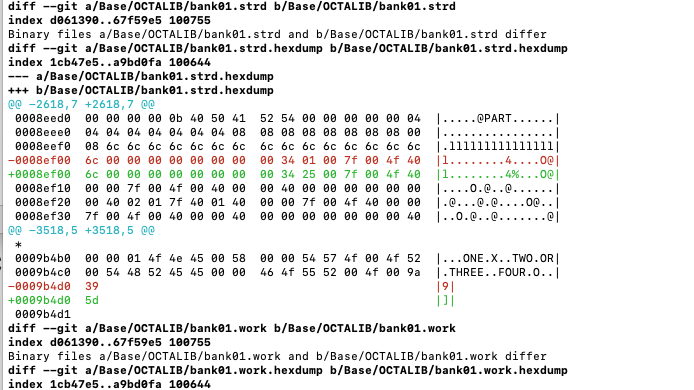

# OctaDoc

This projects aims at documenting the file formats used by the Elektron Octatrack device. 

# general principle
OT files are synced from CF card to a local copy (in DATA_REPOSITORY)
they are dumped to hex files, more human readable and easier to track for
modifications
All files are commited to git and difference dumped

# Workflow Sequence after init
1. Open or create new project on the OT
2. save project
3. Enter USB mode
4. from this root directory, run ./octa-sync.sh 
5. from this root directory, run ./octa-track.sh ; When prompted, describe at has changed (in one line)
6. eject octatrack drive and leave USB mode
7. change a single thing 
8. go back to 2. above

# Usable result
The git log  and diff shows what bytes were modified at step 7

